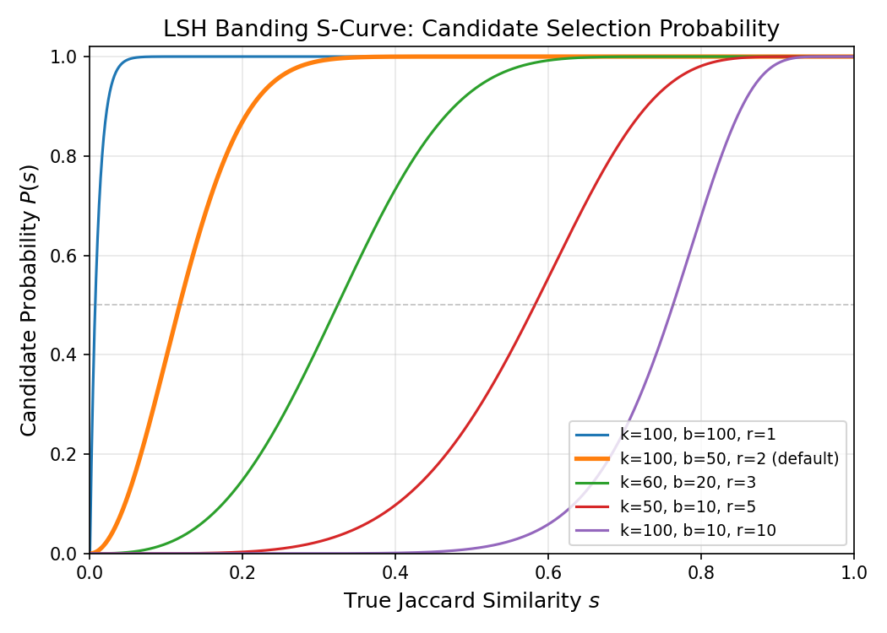
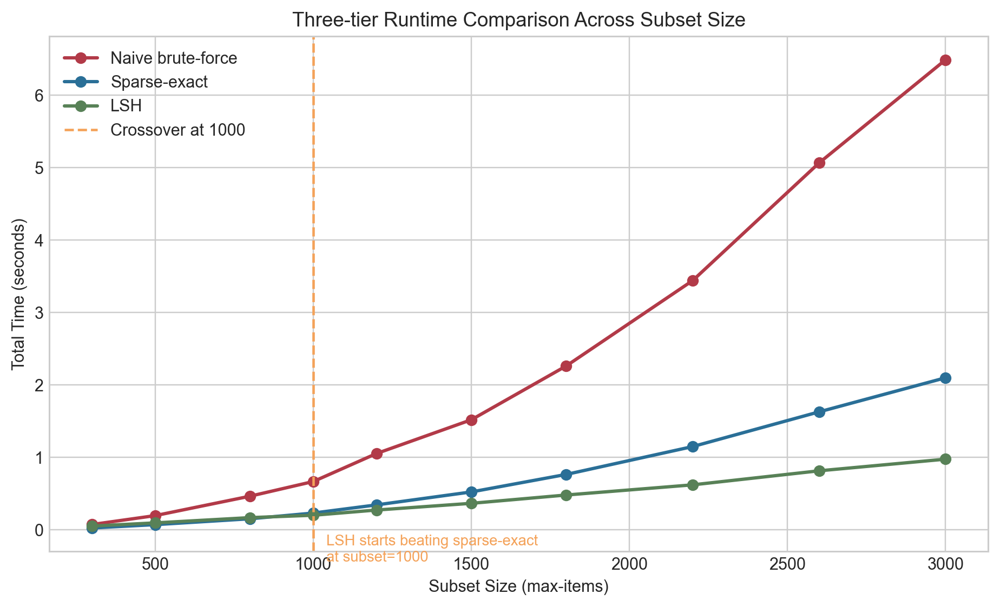
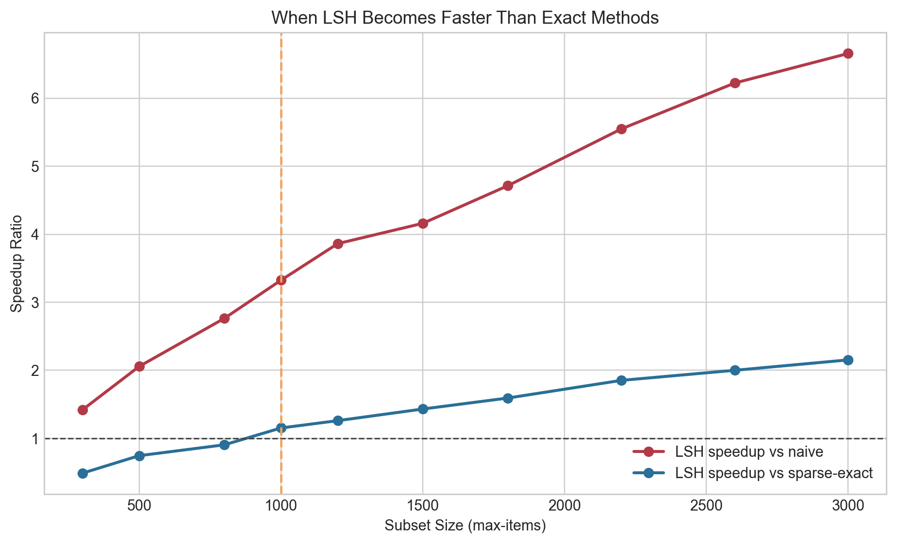
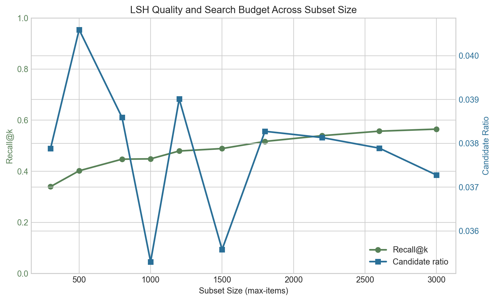
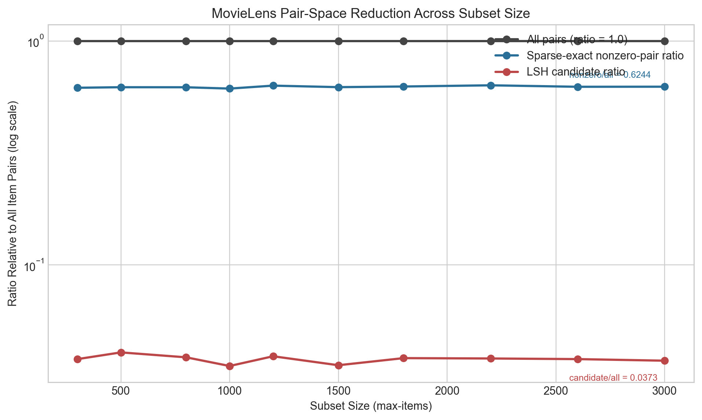
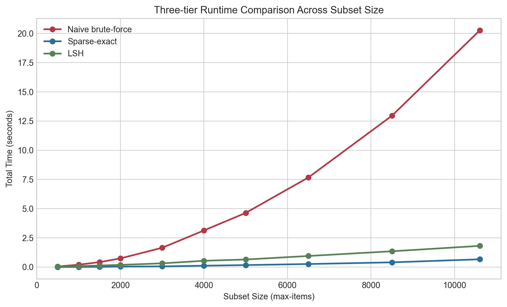
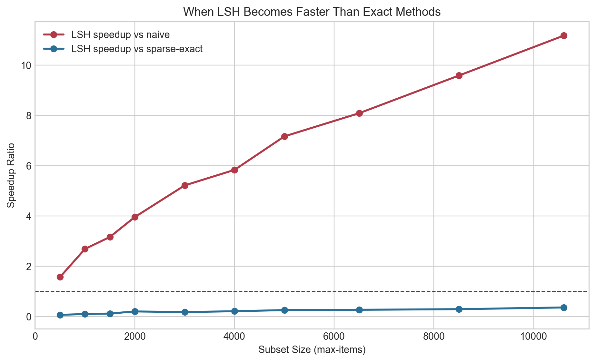
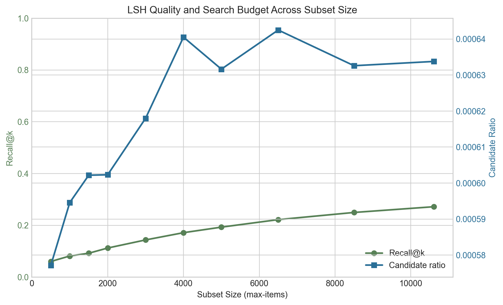
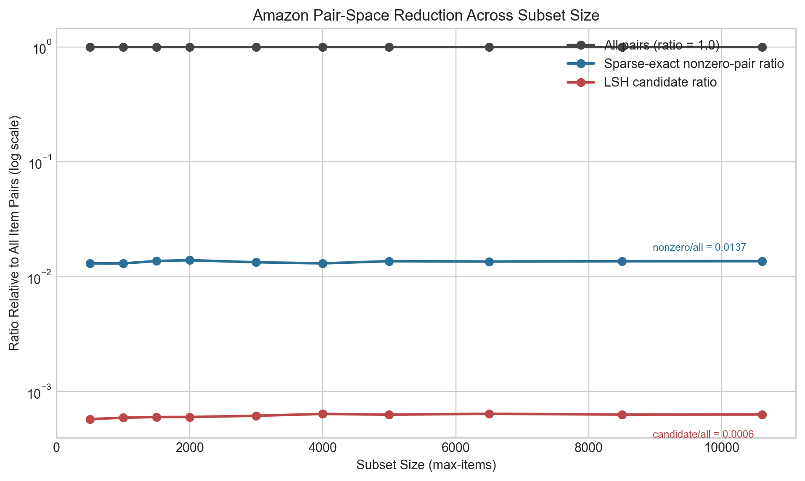
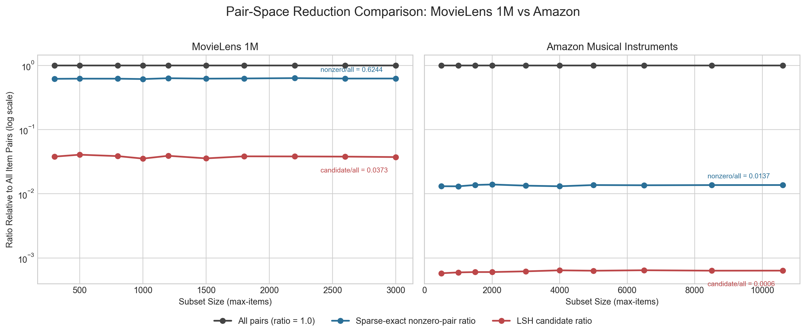

# Accelerating Item-Based Collaborative Filtering with Locality-Sensitive Hashing

## Abstract

Item-based collaborative filtering requires computing pairwise similarities among all items, which scales quadratically with the number of items. Locality-Sensitive Hashing (LSH) with MinHash signatures is a well-known technique for approximating Jaccard similarity and reducing this computational burden. In this report, we implement a three-tier comparison framework — naive brute-force, optimized sparse exact computation, and MinHash+LSH — and evaluate them on two real-world datasets: MovieLens 1M and Amazon Musical Instruments 5-core. Our experiments reveal that the effectiveness of LSH depends critically on dataset density. On the moderately dense MovieLens dataset, LSH achieves a 2.15$\times$ speedup over the sparse exact baseline at 3000 items with recall@10 of 0.565. On the extremely sparse Amazon dataset, LSH never outperforms the sparse exact baseline, because sparsity alone already eliminates most of the pairwise search space. These contrasting results demonstrate that LSH is not a universal improvement; its practical value is governed by the nonzero-pair ratio of the underlying data.

---

## 1. Introduction

Recommender systems are a core component of modern information platforms. Among the many approaches, item-based collaborative filtering (item-CF) identifies similar items based on user interaction patterns and recommends items that are similar to those a user has previously liked. A key computational challenge in item-CF is the pairwise similarity computation: given $n$ items, computing all $\binom{n}{2}$ pairwise similarities has $O(n^2)$ complexity, which becomes prohibitive as the item catalogue grows.

In the binary-preference setting, where each user–item interaction is represented as a binary indicator (e.g., "liked" or "not liked"), the Jaccard coefficient is a natural similarity measure. Jaccard similarity between two items $i$ and $j$ is defined as:

$$J(i, j) = \frac{|U_i \cap U_j|}{|U_i \cup U_j|}$$

where $U_i$ and $U_j$ denote the sets of users who have interacted with items $i$ and $j$, respectively.

MinHash combined with Locality-Sensitive Hashing (LSH) is a classical technique for approximately identifying high-Jaccard pairs without exhaustive enumeration. The core idea is to compress each set into a compact signature using random hash functions, then use a banding scheme to efficiently identify candidate pairs that are likely to be similar. This reduces the number of exact similarity evaluations from $O(n^2)$ to a much smaller set of candidates.

The goal of this project is to investigate the practical effectiveness of MinHash+LSH for accelerating item-based collaborative filtering with Jaccard similarity. Specifically, we ask: **Under what conditions does LSH provide a meaningful speedup over an optimized exact baseline, and when does it fail to do so?**

We study this question using two datasets with contrasting characteristics — MovieLens 1M (moderate density) and Amazon Musical Instruments 5-core (extreme sparsity) — and show that dataset density is the decisive factor.

---

## 2. Related Work

### 2.1 Item-Based Collaborative Filtering

Item-based collaborative filtering was popularized by Sarwar et al. (2001) and has become a standard approach in production recommender systems, notably at Amazon. The method precomputes an item-item similarity matrix and, at recommendation time, selects items most similar to those the target user has interacted with. The main computational bottleneck is the offline similarity computation step.

### 2.2 Jaccard Similarity and MinHash

The Jaccard coefficient is a set similarity measure widely used in information retrieval, near-duplicate detection, and recommendation. For binary interaction data, each item can be represented as the set of users who interacted with it, and Jaccard similarity captures the overlap between two such sets.

MinHash (Broder, 1997) provides an efficient way to estimate Jaccard similarity. The key theoretical result is that for a random permutation $\pi$ of the universe of users, the probability that two sets $A$ and $B$ share the same minimum element under $\pi$ equals their Jaccard similarity:

$$\Pr[\min(\pi(A)) = \min(\pi(B))] = J(A, B)$$

In practice, $k$ independent hash functions are used in place of true random permutations, producing a signature vector of length $k$ for each item. The fraction of positions where two signatures agree estimates the Jaccard similarity.

### 2.3 Locality-Sensitive Hashing (LSH) Banding

To identify candidate pairs efficiently, the signature matrix is divided into $b$ bands of $r$ rows each, where $k = b \times r$. Two items become a candidate pair if their signatures agree in all $r$ rows of at least one band. The probability that two items with true Jaccard similarity $s$ become candidates is:

$$P(s) = 1 - (1 - s^r)^b$$

This S-shaped curve acts as a threshold function. By choosing $b$ and $r$ appropriately, the system can be tuned to generate candidates only for pairs above a certain similarity threshold, avoiding most dissimilar-pair comparisons. A smaller $r$ (more bands) makes the filter more permissive (higher recall, more candidates), while a larger $r$ makes it more restrictive (lower recall, fewer candidates). Figure 0 illustrates this effect for five configurations used or referenced in our experiments.

**Figure 0.** LSH banding S-curve $P(s) = 1-(1-s^r)^b$ for five configurations. Smaller $r$ shifts the threshold leftward, admitting more candidate pairs (higher recall but more verification work). The default configuration ($b=50$, $r=2$) has an approximate threshold near $s \approx 0.14$. At $r=1$, nearly all pairs with any overlap become candidates; at $r=10$, only very high-similarity pairs pass.

### 2.4 LSH for Recommendations

Several prior works have applied LSH to recommendation settings. Das et al. (2007) used LSH for scalable news recommendation at Google. More generally, approximate nearest neighbor techniques including LSH have been studied for large-scale similarity search (Andoni & Indyk, 2008). However, most studies focus on dense feature spaces or cosine similarity. The specific combination of binary preferences, Jaccard similarity, and the interplay with sparse-matrix baselines is less commonly analyzed in detail.

---

## 3. Methodology

### 3.1 Problem Formulation

Given a user–item interaction matrix, we binarize preferences using a threshold (rating $\geq 4$ is treated as a positive interaction). Each item $i$ is represented as the set $U_i$ of users who have a positive interaction with it. The task is to find, for each item, its top-$k$ most similar items under Jaccard similarity.

### 3.2 Three-Tier Comparison Framework

We implement three methods with increasing levels of optimization:

**Tier 1: Naive brute-force.** For each pair of items $(i, j)$, compute the Jaccard similarity by iterating over the user sets in Python. This has $O(n^2)$ pair evaluations and serves as the baseline worst case.

**Tier 2: Sparse exact computation.** Represent the binary user–item matrix as a sparse CSC matrix and compute pairwise dot products using sparse matrix multiplication ($X^\top X$). The dot product gives $|U_i \cap U_j|$ directly, and combined with precomputed set sizes, the Jaccard similarity is obtained as:

$$J(i,j) = \frac{|U_i \cap U_j|}{|U_i| + |U_j| - |U_i \cap U_j|}$$

This method automatically skips pairs with zero intersection — if items $i$ and $j$ share no users, the sparse multiplication produces no entry for that pair. This makes it highly efficient on sparse data.

**Tier 3: MinHash + LSH.** Compute MinHash signatures of length $k$ for each item, apply the banding scheme with $b$ bands of $r$ rows to generate candidate pairs, then perform exact Jaccard verification only on candidates using batched sparse operations.

### 3.3 Datasets

We use two publicly available datasets with contrasting density characteristics:

| Property | MovieLens 1M | Amazon Musical Instruments 5-core |
|---|---:|---:|
| Number of items | 3,533 | 10,606 |
| Number of users | 6,038 | 27,449 |
| Positive interactions | 575,281 | 190,095 |
| Matrix density | 2.70% | 0.065% |
| Median item support | 49 users | 8 users |

**MovieLens 1M** (Harper & Konstan, 2015) contains 1 million movie ratings from 6,040 users on 3,706 movies. After filtering to ratings $\geq 4$, we retain 575,281 positive interactions across 3,533 items and 6,038 users. The resulting binary matrix has a density of 2.70%, which is moderate by collaborative filtering standards.

**Amazon Musical Instruments 5-core** (McAuley et al., 2015) contains product reviews where each user and item has at least 5 interactions. After applying the same rating $\geq 4$ threshold, we retain 190,095 positive interactions across 10,606 items and 27,449 users. The matrix density is only 0.065% — roughly 40 times sparser than MovieLens.

### 3.4 Evaluation Metrics

We evaluate the methods along two axes: computational efficiency and retrieval quality.

**Runtime** is measured as wall-clock time in seconds. For LSH, this includes signature generation, candidate generation, and verification.

**Speedup ratio** is defined as the runtime of a reference method divided by the runtime of LSH:

$$\text{Speedup} = \frac{T_{\text{reference}}}{T_{\text{LSH}}}$$

A value greater than 1 indicates that LSH is faster.

**Recall@k** measures the fraction of exact top-$k$ neighbors recovered by the approximate method:

$$\text{Recall@}k = \frac{\sum_{i=1}^{n} |E_i \cap A_i|}{\sum_{i=1}^{n} |E_i|}$$

where $E_i$ is the exact top-$k$ neighbor set for item $i$ and $A_i$ is the approximate set returned by LSH.

**Candidate ratio** measures the fraction of the total pair space examined by LSH:

$$\text{Candidate ratio} = \frac{|\mathcal{C}|}{\binom{n}{2}}$$

where $|\mathcal{C}|$ is the number of candidate pairs generated by the banding scheme.

**Nonzero-pair ratio** measures the fraction of item pairs that have at least one user in common:

$$\text{Nonzero-pair ratio} = \frac{|\{(i,j) : |U_i \cap U_j| > 0\}|}{\binom{n}{2}}$$

This metric captures how much work the sparse exact method avoids compared to naive enumeration, and turns out to be the key factor explaining the relative performance of LSH.

### 3.5 Experimental Setup

For each dataset, we run scaling experiments by sampling random subsets of items at increasing sizes. The default LSH configuration uses $k = 100$ MinHash functions, $b = 50$ bands, and $r = 2$ rows per band. All experiments use $\text{top-}k = 10$ and a fixed random seed of 42 for reproducibility.

On the Amazon dataset, we additionally perform a tuning sweep across 16 LSH configurations with varying numbers of hash functions ($k \in \{20, 60, 100, 200\}$) and rows per band ($r \in \{1, 2, 3, 4, 5, 10\}$) to test whether any configuration can beat the sparse exact baseline.

---

## 4. Experiments — MovieLens 1M

### 4.1 Runtime Scaling

Table 1 reports the runtime of all three methods as the subset size increases from 300 to 3,000 items.

**Table 1.** Runtime comparison on MovieLens 1M (top-$k = 10$, LSH config: $k=100$, $b=50$, $r=2$).

| Subset size | Naive (s) | Sparse exact (s) | LSH (s) | Recall@10 | LSH vs Sparse exact |
|---:|---:|---:|---:|---:|---:|
| 300 | 0.073 | 0.025 | 0.051 | 0.340 | 0.49$\times$ |
| 500 | 0.196 | 0.071 | 0.095 | 0.402 | 0.75$\times$ |
| 800 | 0.464 | 0.152 | 0.168 | 0.447 | 0.90$\times$ |
| 900 | 0.507 | 0.197 | 0.184 | 0.428 | 1.07$\times$ |
| 1,000 | 0.666 | 0.231 | 0.200 | 0.449 | 1.15$\times$ |
| 1,200 | 1.053 | 0.343 | 0.273 | 0.479 | 1.26$\times$ |
| 1,500 | 1.519 | 0.523 | 0.365 | 0.489 | 1.43$\times$ |
| 1,800 | 2.262 | 0.764 | 0.480 | 0.517 | 1.59$\times$ |
| 2,200 | 3.441 | 1.149 | 0.620 | 0.539 | 1.85$\times$ |
| 2,600 | 5.066 | 1.628 | 0.814 | 0.557 | 2.00$\times$ |
| 3,000 | 6.491 | 2.099 | 0.975 | 0.565 | 2.15$\times$ |

The naive brute-force baseline scales quadratically and becomes inefficient quickly. The sparse exact baseline is substantially stronger and remains competitive at moderate sizes. LSH begins to outperform the sparse exact method when the subset size reaches roughly **900–1,000 items**, and from 1,200 items onward the speed advantage becomes clear and stable. At 3,000 items (the full dataset), LSH is 2.15$\times$ faster than sparse exact and 6.66$\times$ faster than naive brute-force.

**Figure 1.** Runtime of three similarity-search methods on MovieLens 1M as the item subset size increases. The crossover between LSH and the sparse exact baseline occurs near 900–1,000 items.

### 4.2 Speedup Analysis

**Figure 2.** Speedup of MinHash+LSH relative to the naive brute-force baseline and the sparse exact baseline on MovieLens 1M. The speedup ratio is defined as $T_{\text{reference}} / T_{\text{LSH}}$; a value greater than 1 indicates that LSH is faster. The horizontal line at 1 serves as the break-even threshold. The speedup against the sparse exact baseline crosses 1 near the 900–1,000 item range, confirming the crossover observed in the runtime plot.

### 4.3 Quality–Efficiency Tradeoff

**Figure 3.** Retrieval quality and search budget of MinHash+LSH on MovieLens 1M across subset size. Recall@$k$ measures the fraction of exact top-$k$ neighbors recovered by LSH, while candidate ratio measures the fraction of all possible item pairs generated as LSH candidates. Recall@10 increases from 0.340 at 300 items to 0.565 at 3,000 items, indicating that the signature-based filter performs better on larger subsets where more items share users. The candidate ratio remains between 3.5% and 4.1%, showing that LSH consistently prunes the search space to a small fraction of all pairs.

### 4.4 Pair-Space Reduction

**Figure 3a.** Comparison of the full all-pairs search space, the sparse exact nonzero-pair ratio, and the LSH candidate ratio on MovieLens 1M (log scale). Although the sparse exact baseline avoids evaluating all theoretical pairs, the proportion of item pairs with nonzero overlap remains relatively large on this dataset (approximately 62% of all pairs). LSH reduces the candidate set much more aggressively (to roughly 3.7% of all pairs), which leads to the observed runtime crossover.

---

## 5. Experiments — Amazon Musical Instruments

### 5.1 Runtime Scaling

Table 2 reports the runtime of all three methods on the Amazon dataset as the subset size increases from 500 to the full 10,606 items.

**Table 2.** Runtime comparison on Amazon Musical Instruments 5-core (top-$k = 10$, LSH config: $k=100$, $b=50$, $r=2$).

| Subset size | Naive (s) | Sparse exact (s) | LSH (s) | Recall@10 | LSH vs Sparse exact |
|---:|---:|---:|---:|---:|---:|
| 500 | 0.051 | 0.002 | 0.032 | 0.060 | 0.07$\times$ |
| 1,000 | 0.199 | 0.008 | 0.074 | 0.081 | 0.10$\times$ |
| 1,500 | 0.421 | 0.016 | 0.133 | 0.092 | 0.12$\times$ |
| 2,000 | 0.739 | 0.039 | 0.186 | 0.112 | 0.21$\times$ |
| 3,000 | 1.651 | 0.058 | 0.316 | 0.143 | 0.18$\times$ |
| 4,000 | 3.134 | 0.116 | 0.537 | 0.171 | 0.22$\times$ |
| 5,000 | 4.638 | 0.169 | 0.647 | 0.193 | 0.26$\times$ |
| 6,500 | 7.669 | 0.260 | 0.948 | 0.222 | 0.27$\times$ |
| 8,500 | 12.957 | 0.402 | 1.351 | 0.250 | 0.30$\times$ |
| 10,606 | 20.278 | 0.665 | 1.814 | 0.272 | 0.37$\times$ |

The picture is strikingly different from MovieLens. **No runtime crossover is observed at any subset size.** Even at the full 10,606 items, sparse exact computation finishes in 0.665 seconds — nearly 3$\times$ faster than LSH (1.814 s). The speedup ratio against sparse exact remains below 0.37 throughout, meaning LSH is always slower than the optimized exact baseline. Meanwhile, recall@10 reaches only 0.272 at full scale.

**Figure 4.** Runtime of three similarity-search methods on Amazon Musical Instruments 5-core as the item subset size increases. Unlike MovieLens, no crossover between LSH and the sparse exact baseline is observed.

### 5.2 Speedup Analysis

**Figure 5.** Speedup of MinHash+LSH relative to the two baselines on Amazon. The LSH-vs-sparse-exact curve (green) remains well below 1 for all tested subset sizes, confirming that LSH never overtakes the sparse exact baseline.

### 5.3 Quality–Efficiency Tradeoff

**Figure 6.** Retrieval quality and search budget on Amazon. Recall@10 reaches only 0.272 at full scale, and the candidate ratio stays below 0.07%, reflecting the extremely sparse overlap structure of this dataset.

### 5.4 Pair-Space Reduction

**Figure 7.** Pair-space reduction on Amazon (log scale). The nonzero-pair ratio is already very small (approximately 1.4%), meaning that the sparse exact method only needs to process a tiny fraction of the theoretical pair space. LSH reduces the candidate space further, but the additional reduction is not large enough to offset signature and verification overhead.

### 5.5 LSH Tuning Sweep

To verify that the Amazon result is not an artifact of a single LSH configuration, we ran 16 additional configurations varying the number of hash functions ($k \in \{20, 60, 100, 200\}$) and rows per band ($r \in \{1, 2, 3, 4, 5, 10\}$).

The results fall into three distinct regions:

| Region | Rows per band | Recall@10 | Runtime (s) | vs Sparse exact |
|---|---:|---:|---:|---:|
| High recall | $r = 1$ | 0.74 – 0.96 | 1.6 – 5.5 | 2.4$\times$ – 8.2$\times$ slower |
| Medium recall | $r = 2$ | 0.18 – 0.45 | 1.1 – 2.6 | 1.7$\times$ – 3.9$\times$ slower |
| Low recall / fast | $r \geq 3$ | < 0.02 | 0.4 – 0.9 | some faster than exact |

Using $r = 1$ (every hash function forms its own band) achieves recall@10 up to 0.96, but at 5–8$\times$ the runtime of sparse exact. Using $r \geq 3$ can be faster than sparse exact, but with recall below 0.02 — essentially useless for recommendation. **No configuration achieves both competitive recall and competitive runtime.** This confirms that the failure of LSH on this dataset is structural, not a tuning issue.

---

## 6. Discussion

### 6.1 Density as the Decisive Factor

The central finding of this study is that dataset density — specifically, the nonzero-pair ratio — determines whether LSH can outperform an optimized sparse exact baseline.

**Table 3.** Density comparison between datasets.

| Metric | MovieLens 1M | Amazon MI 5-core |
|---|---:|---:|
| Matrix density | 2.70% | 0.065% |
| Density ratio | — | ~40$\times$ sparser |
| Median item support | 49 users | 8 users |
| Nonzero-pair ratio | ~62% | ~1.4% |

On MovieLens, 62% of all item pairs share at least one user. This means the sparse exact method, while faster than naive enumeration, still processes a large number of pairs. LSH's candidate set (~3.7% of all pairs) represents a substantial reduction over sparse exact's workload, which eventually translates into a runtime advantage.

On Amazon, only 1.4% of item pairs have nonzero overlap. The sparse exact method already skips 98.6% of all pairs for free, leaving very little room for LSH to provide additional savings. Any LSH configuration aggressive enough to beat sparse exact on speed produces so few candidates that most true neighbors are missed.

### 6.2 Why is the Sparse Exact Baseline So Strong?

The sparse-matrix multiplication approach ($X^\top X$) is often omitted from LSH evaluations, which compare against naive $O(n^2)$ brute-force. In practice, scipy's sparse CSC multiplication is highly optimized and benefits directly from data sparsity: the fewer nonzero entries exist, the less work the multiplication requires. This creates a paradox for LSH: the sparser the data, the stronger the exact baseline, and the harder it is for an approximate method to compete.

### 6.3 When is LSH Worthwhile?

Based on our experiments, LSH provides practical speedups when:

1. **The dataset is moderately dense**, so that the nonzero-pair ratio is high enough that sparse exact computation still has substantial work to do.
2. **The item catalogue is large enough** for LSH's $O(n)$ signature computation and efficient candidate generation to amortize over the number of items.
3. **Approximate results are acceptable**, since LSH fundamentally trades off recall for speed.

Conversely, LSH is unlikely to help when the interaction matrix is very sparse, because optimized exact methods already exploit sparsity to avoid most computations.

### 6.4 Side-by-Side Pair-Space Comparison

**Figure 8.** Side-by-side pair-space reduction comparison between MovieLens 1M (left) and Amazon Musical Instruments 5-core (right). Each panel shows the all-pairs baseline, the sparse exact nonzero-pair ratio, and the LSH candidate ratio on a logarithmic scale. On MovieLens, the nonzero-pair ratio remains high, leaving substantial room for LSH to reduce the search space. On Amazon, the nonzero-pair ratio is already very low, so sparsity alone removes most of the search burden, leaving LSH little room for improvement.

### 6.5 Limitations

- **Single LSH family.** We only studied MinHash with Jaccard similarity. Other LSH families (e.g., random hyperplane LSH for cosine similarity) or learned hash functions may perform differently.
- **Binary preferences only.** Real-world systems often use weighted ratings, which would require different similarity measures.
- **Static evaluation.** We measure offline similarity computation time. In a production setting, incremental updates and online serving latency may change the tradeoff.
- **Subset sampling.** Our scaling experiments sample random subsets of items. The actual item overlap structure may differ from the sampled subsets, particularly at small sizes.

---

## 7. Conclusion

We implemented and evaluated a three-tier comparison framework for item-based collaborative filtering with Jaccard similarity: naive brute-force, optimized sparse exact computation, and MinHash+LSH. Experiments on MovieLens 1M and Amazon Musical Instruments 5-core reveal a clear dichotomy:

- On the moderately dense MovieLens dataset (density 2.70%, nonzero-pair ratio ~62%), LSH achieves a runtime crossover at approximately 900–1,000 items, reaching a 2.15$\times$ speedup at 3,000 items with recall@10 of 0.565.
- On the extremely sparse Amazon dataset (density 0.065%, nonzero-pair ratio ~1.4%), no LSH configuration achieves both competitive speed and acceptable recall. The sparse exact baseline is simply too efficient.

The key insight is that **LSH's advantage depends on the gap between the total pair space and the nonzero-pair space.** When this gap is small (dense data), sparse exact computation still has substantial work to do, and LSH provides meaningful acceleration. When the gap is large (sparse data), sparsity already eliminates most unnecessary computation, leaving LSH unable to improve upon exact methods.

This finding has practical implications: before deploying LSH for item-CF, practitioners should assess the nonzero-pair ratio of their data. On dense interaction matrices, LSH is a valuable tool for scaling similarity search. On sparse matrices, the simpler sparse exact computation may be both faster and exact.

---

## References

1. Andoni, A., & Indyk, P. (2008). Near-optimal hashing algorithms for approximate near neighbor in high dimensions. *Communications of the ACM*, 51(1), 117–122.
2. Broder, A. Z. (1997). On the resemblance and containment of documents. *Proceedings of the Compression and Complexity of Sequences*, 21–29.
3. Das, A. S., Datar, M., Garg, A., & Rajaram, S. (2007). Google news personalization: Scalable online collaborative filtering. *Proceedings of the 16th International Conference on World Wide Web*, 271–280.
4. Harper, F. M., & Konstan, J. A. (2015). The MovieLens datasets: History and context. *ACM Transactions on Interactive Intelligent Systems*, 5(4), 1–19.
5. McAuley, J., Targett, C., Shi, Q., & Van Den Hengel, A. (2015). Image-based recommendations on styles and substitutes. *Proceedings of the 38th International ACM SIGIR Conference*, 43–52.
6. Sarwar, B., Karypis, G., Konstan, J., & Riedl, J. (2001). Item-based collaborative filtering recommendation algorithms. *Proceedings of the 10th International Conference on World Wide Web*, 285–295.
